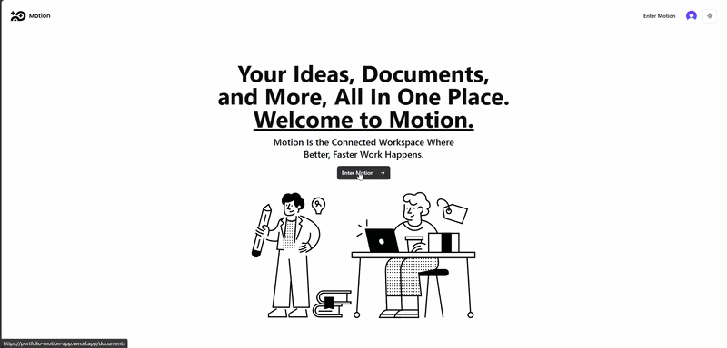

# Motion App

A modern, real-time workspace and note-taking application designed for individuals and teams to organize their thoughts, documents, and files seamlessly.

🔗 **Live Demo:** [https://portfolio-motion-app.vercel.app](https://portfolio-motion-app.vercel.app)  
🌐 **Portfolio:** [https://aymenghris.vercel.app](https://aymenghris.vercel.app)  

## 📸 Preview

## ✨ Key Features
- **Notion-style Editor:** A powerful rich-text block-based editor for seamless writing and formatting.
- **Real-time Synchronization:** Instant updates across all connected devices using a reactive database.
- **File Management:** Upload, store, and manage files and images easily within your documents.
- **Secure Authentication:** Robust user login, registration, and route protection.
- **Nested Documents:** Create infinite hierarchical document structures to organize your workspace.
- **Responsive Design:** Fully optimized for mobile, tablet, and desktop viewing.

## 🛠 Tech Stack
- **Frontend:** Next.js, React, Tailwind CSS, Zustand, BlockNote
- **Backend/Services:** Convex, Clerk, EdgeStore
- **Deployment:** Vercel

## 💡 What I Learned
- **Security:** Integrated robust, secure authentication and authorization flows to protect user data and application routes.
- **UI/UX Engineering:** Engineered dynamic, system-aware theming (Dark/Light mode) coupled with responsive favicon adaptations.
- **Code Quality:** Abstracted complex component logic into reusable React Custom Hooks, promoting DRY principles and codebase maintainability.
- **Cloud Storage:** Gained proficiency in cloud file storage using EdgeStore, including bucket configuration, secure file uploads, and asset management.
- **Perceived Performance:** Enhanced user experience by implementing skeleton loaders during asynchronous data fetching.
- **Web APIs:** Utilized the Web Clipboard API (`navigator.clipboard`) to facilitate seamless data copying and improve user workflows.

## 👤 Contact
[LinkedIn](https://linkedin.com/in/aymenghris) • [Email](mailto:aymenghris@outlook.com) • [GitHub](https://github.com/aymenghris)